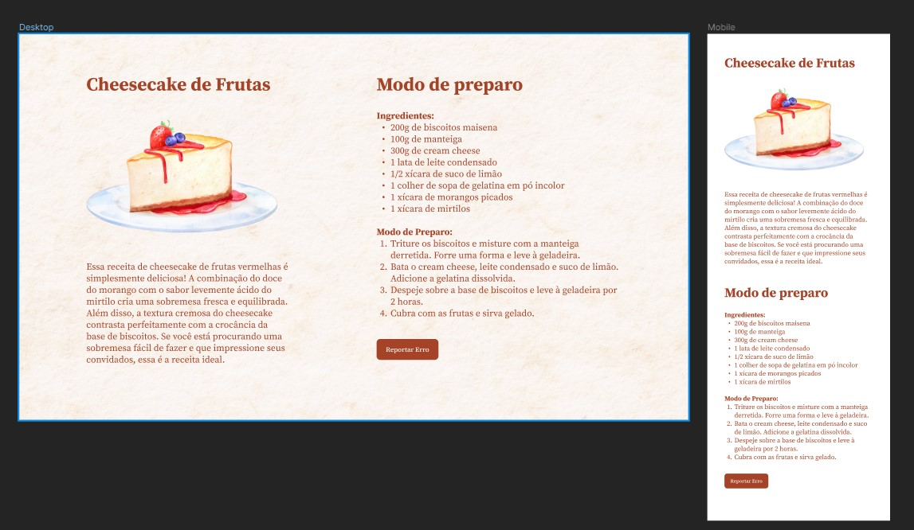

<h1 align="center"> 🍰 Cheesecake 🍰</h1>

Projeto pessoal utilizando conceitos de mobile first e responsividade.

  <a href="#-tecnologias">Tecnologias</a>&nbsp;&nbsp;&nbsp;|&nbsp;&nbsp;&nbsp;
  <a href="#-projeto">Projeto</a>&nbsp;&nbsp;&nbsp;|&nbsp;&nbsp;&nbsp;
  <a href="#-layout">Layout</a>&nbsp;&nbsp;&nbsp;

 

  

## 🚀 Tecnologias

Esse projeto foi desenvolvido com as seguintes tecnologias:

- HTML e CSS
- Git e Github
- Figma

## 💻 Projeto

O Cheesecake é uma pagina de uma receita de cheesecake de frutas em que os usuários podem consultar em dispositivos desktops e móveis. Clique <a href="https://cheesecake-mobile-first-layout.vercel.app/">aqui</a> para testar a página.

## 🎨 Layout

Clique <a href="https://www.figma.com/file/XdxR2LxDrKLkdfc1mRUIv3/Cheesecake-%E2%80%A2-Projeto-Explorer-Community?type=design&is-community-duplicate=1&fuid=">aqui</a> para conhecer a prototipagem do projeto.
 
 
 
 

Desenvolvido com ♥ by Mateus de Castro Macedo 👨‍💻

